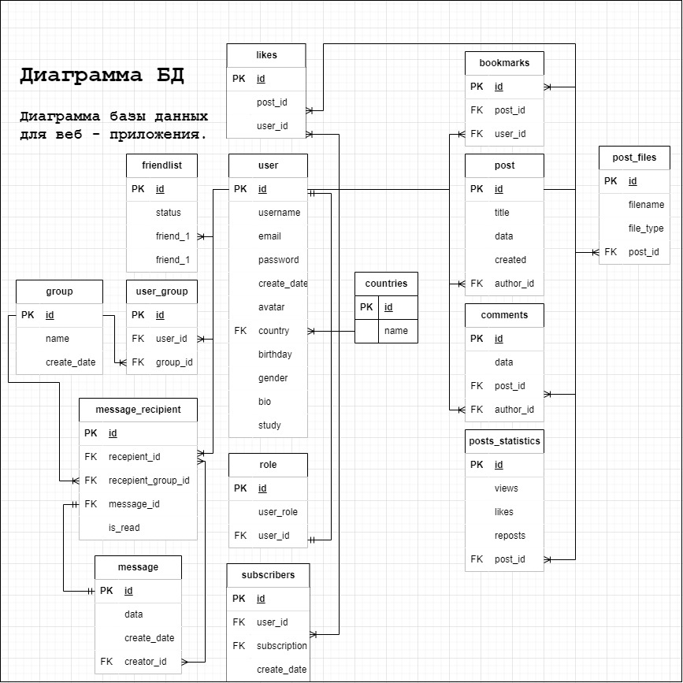
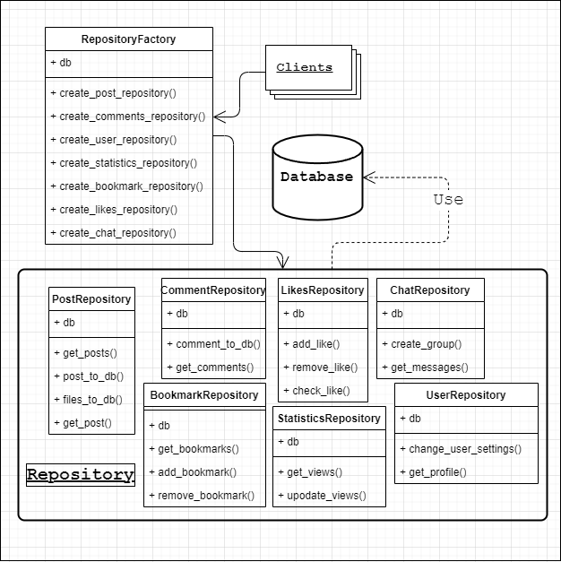
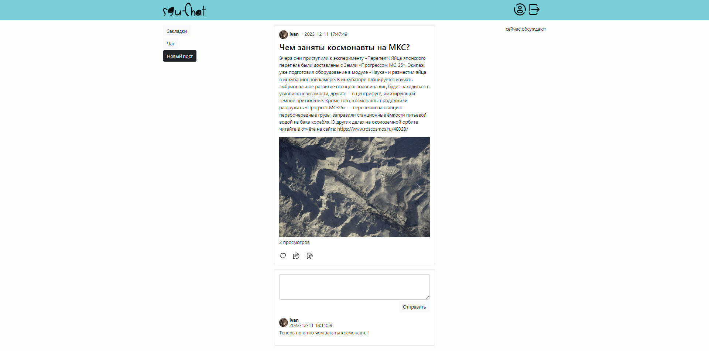

# sgu-chat

Данный проект - это моя практическая работа по нескольким предметам из курса моего университета. Здесь я пытаюсь объединить сразу несколько методов проектирования систем, а так же демонстрирую знание языка запросов - SQL.  

## 📚 Путеводитель

- [Диаграмма сценариев использования](#-диаграмма-сценариев-использования)
- [Диаграмма последовательностей](#-диаграмма-последовательностей)
- [Диаграмма структуры БД](#-диаграмма-структуры-бд)
- [Диаграмма структуры программы](#-диаграмма-структуры-программы)
- [Скриншоты пользовательского интерфейса](#-пользовательский-интерфейс)

## 📲 Диаграмма сценариев использования

На диаграмме изображено, как пользователь может использовать приложение.

## 📅 Диаграмма последовательностей

А на данной диаграмме изображено, как происходит оплата подписки пользователем.

## 📕 Диаграмма структуры БД

Здесь вы можете наблюдать как устроена структура базы данных.

## ⚙️ Диаграмма структуры программы

По такой логике реализуется передача данных из БД в flask-функцию, которая
реализует страницу веб-приложения.

## 👴 Пользовательский интерфейс

На странице профиля можно выполнять различные действия. Доступны следующие функции:

- [x] Смена аватара
- [x] Смена имени
- [x] Добавления статуса и описания предмета, который пользователь изучает

##

##

Эта домашняя страница веб - приложения. Функции, которые доступны на этой странице:

- [x] Добавление статьи
- [x] Действия со статьями (лайк и т.д.)
- [x] Навигация по сайту(переход на страницу чата, на страницу с закладками пользователя и т.д.)
- [ ] Обновления действий пользователей на сайте (комментарии, постинг и др.)

##

Страница поста. На этой же странице доступны следующие функции:

- [x] Добавления комментария
- [x] Действия со статьей (лайк и т.д.)

##

Страница диалогов пользователя. Есть следующие возможности:

- [x] Создание диалога
- [ ] Управление диалогами

##

На странице диалога доступны следующие методы:

- [x] Возможность добавить новых участников в чат
- [x] Управление беседой (смена автара чата, названия и т.д.)

##

Страница друзей пользователя.

- [x] Действия с друзьями пользователя

##