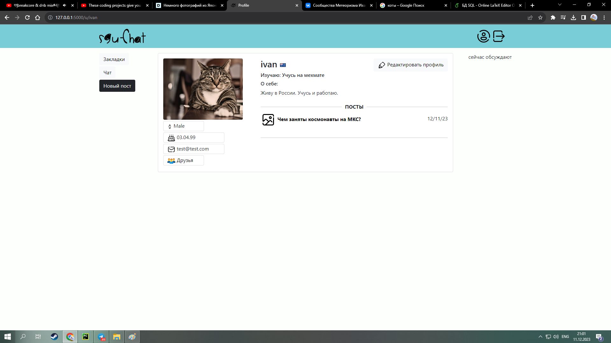
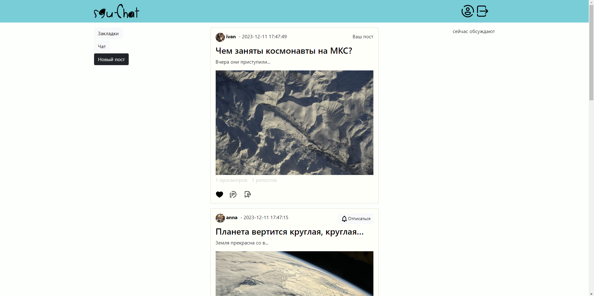
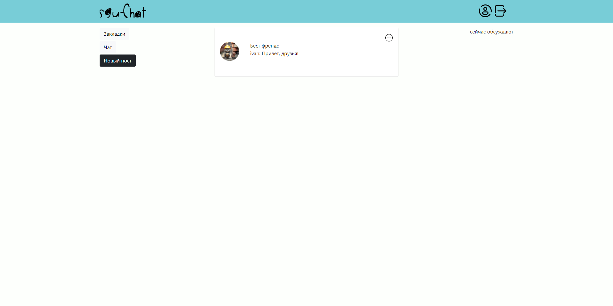
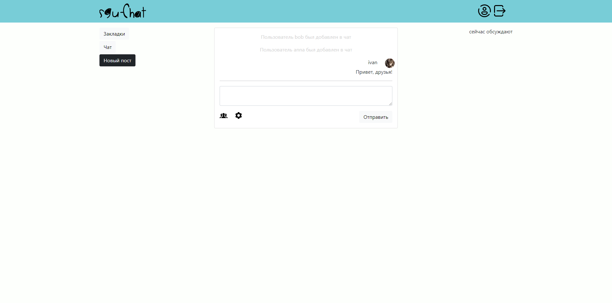

# sgu-chat
Данный проект - это моя практическая работа по нескольким предметам из курса моего университета. Здесь я пытаюсь объединить сразу несколько методов проектирования систем, а так же демонстрирую знания языка запросов - SQL.  
#### Диаграмма сценариев использования (use case diagram)

#### Диаграмма последовательностей

### Пользовательский интерфейс вы можете наблюдать на картинках ниже
#### Страница профиля пользователя

### Главная страница с постами пользователей

### Страница с диалогами пользователя

### Страница диалога

### Страница друзей пользователя
